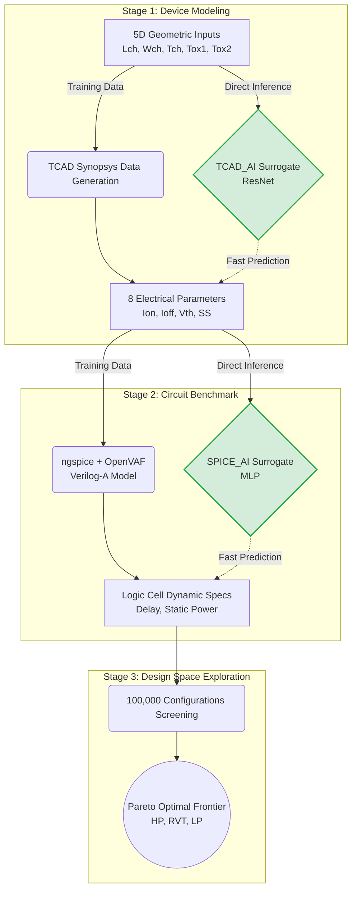
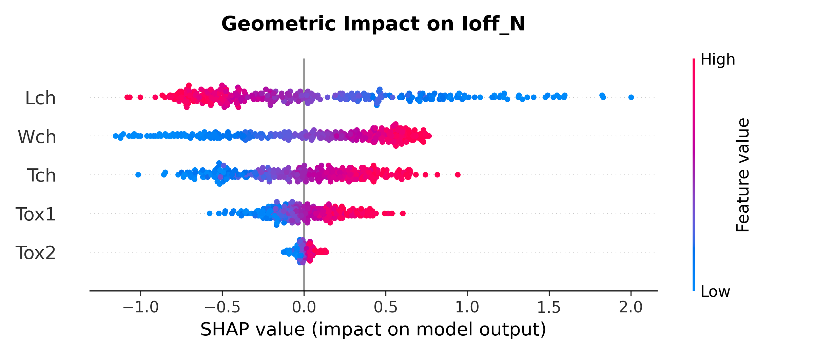
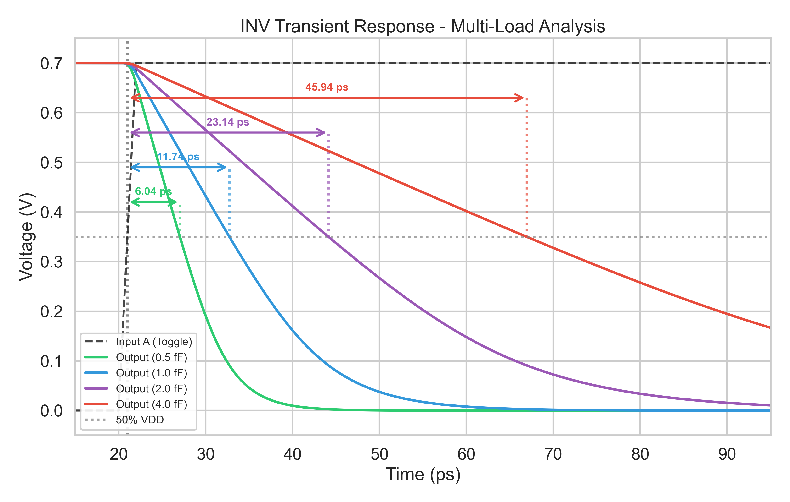

# CFET & 2DFET AI Modeling Pipeline


This repository contains the Machine Learning pipeline and device simulation scripts developed during my research internship at the Parallel and Scientific Computing Laboratory (NYCU, Taiwan). 

The objective of this project is to drastically accelerate the evaluation of advanced 3D semiconductor architectures (Complementary FETs and 2D-FETs). By replacing computationally heavy TCAD and SPICE solvers with optimized Artificial Intelligence models, this framework evaluates chip performance in a fraction of a millisecond.

## Global AI Pipeline

Below is the complete cascaded methodology used in this project. The AI models bypass traditional simulators to instantly predict logic cell specifications from physical dimensions.


## Key Results & Performance

To assess the reliability of this cascaded AI framework, its predictions were validated
against industry-standard physical solvers (Synopsys Sentaurus and `ngspice`) on strictly
unseen test data. Absolute values should be read as an idealized upper bound of the
transistor's potential rather than a fully calibrated industrial specification —
see [Limitations](#limitations) below.

### 1. Stage 1: Device Physics Validation (TCAD_AI)

The `TCAD_AI` surrogate predicts the 8 static electrical characteristics of a CFET from
its 5 geometric parameters. On a strictly unseen test set, typical (median) relative
errors are:

| Electrical Parameter | Typical Error | Mean Error |
| :--- | :--- | :--- |
| Threshold Voltage (Vth) | < 0.5% | < 1% |
| Subthreshold Swing (SS) | < 1% | < 2% |
| Drive Current (Ion) | ~ 3.5% | ~ 5% |
| Leakage Current (Ioff) | ~ 4-6% | ~ 5-13% |

Example validation for a specific test geometry (`Lch`: 30.35 nm | `Wch`: 25.51 nm |
`Tch`: 7.8 nm | `Tox1`: 0.58 nm | `Tox2`: 1.72 nm):

| Electrical Parameter | TCAD (Target) | AI Prediction | Error (%) |
| :--- | :--- | :--- | :--- |
| **Ion_N** (A) | 3.23e-05 | 3.11e-05 | ~ 3.7% |
| **Ioff_N** (A) | 3.38e-11 | 3.32e-11 | ~ 1.8% |
| **Vth_N** (V) | 0.243 | 0.244 | ~ 0.4% |
| **SS_N** (mV/dec) | 68.56 | 68.63 | ~ 0.1% |
| **Ion_P** (A) | 2.01e-05 | 1.98e-05 | ~ 1.5% |
| **Ioff_P** (A) | 1.67e-11 | 1.62e-11 | ~ 3.0% |
| **Vth_P** (V) | -0.255 | -0.255 | ~ 0.0% |
| **SS_P** (mV/dec) | 68.93 | 68.81 | ~ 0.2% |

**Explainable AI (XAI) Verification:** SHAP (SHapley Additive exPlanations) values and
Sobol variance decomposition were used to check that the network relies on genuine device
physics rather than memorization. Both methods confirm the AI correctly captures the
Short-Channel Effect (leakage current increasing as `Lch` decreases and `Tox1` increases),
without needing this trend to be hard-coded.

> 
> *Figure: SHAP Beeswarm plot showing the physical dependencies learned by the AI for the NMOS leakage current.*

### 2. Stage 2: Dynamic Circuit Simulation (SPICE_AI)

The static electrical parameters generated by Stage 1 are fed into a purely algebraic,
behavioral Verilog-A compact model (no intrinsic gate capacitance — all capacitive loads
are set explicitly in the SPICE netlist). This model is used to characterize propagation
delay and static leakage for three standard logic gates (INV, NAND2, NOR2) via `ngspice`,
producing the ground-truth dataset for the `SPICE_AI` surrogate. **This training dataset
uses a fixed 1.0 fF output load** (fan-out/wiring capacitance is not currently swept as
a design variable — see Limitations).

As a separate, standalone sanity check (not part of the training data), `Plot_Transcient.py`
sweeps the load capacitance (0.5 to 4.0 fF) for a single representative transistor and
plots the resulting waveforms, confirming the compact model reproduces the expected
RC-like delay scaling and correct relative ordering (INV faster than NAND2, NAND2 faster
than NOR2):

> 
> *Figure: Transient response of a representative CFET inverter across multiple load capacitances — a physical validation of the compact model, run independently of the design-space exploration dataset.*

On its own unseen test set, `SPICE_AI` reaches typical relative errors of ~0.1% for
propagation delay and ~0.8% for leakage current — the neural surrogate itself is not the
accuracy bottleneck; the simplifications listed below are.

### 3. High-Speed Design Space Exploration & Pareto Extraction

The main payoff of this pipeline is throughput: a single TCAD-to-SPICE evaluation
traditionally takes minutes, while the cascaded AI framework screens **100,000 synthetic
geometries in a fraction of a second** (GPU batch inference), each at the fixed 1.0 fF
load point described above.

Statistical safeguards are applied before extracting the Pareto frontier: a physical
symmetry filter on the Ion_P/Ion_N ratio, an anti-extrapolation filter that rejects any
candidate whose parameters or predicted outputs fall outside the envelope actually seen
during training, and an industrial power cap. The surviving candidates are K-means
clustered into three flavors:
*   **HP (High Performance):** Maximized switching speed.
*   **LP (Low Power):** Minimized static power consumption.
*   **RVT (Regular VT):** Balance between speed and power.

The resulting Pareto frontier follows the qualitative trends expected from CMOS theory
(monotonic delay/power trade-off, NAND2/NOR2 slower than INV) — see the full report for
the quantitative Pareto tables and a critical discussion of where this exploration is,
and isn't, representative of real fabricated CFETs.

### Limitations

This framework optimizes for **relative ranking speed**, not absolute, silicon-calibrated numbers. To maintain scientific rigor, the following design approximations should be noted:

*   **Area Footprint Bias:** The optimization does not penalize silicon area. Consequently, the extracted Pareto frontier inherently favors devices with large channel widths (`Wch`) to maximize drive current, without accounting for the loss in integration density.
*   **Absence of Parasitic Resistance:** The compact behavioral model omits series contact and deep via resistances, which are widely identified as the dominant real-world performance bottleneck for CFET architectures.
*   **Circuit Characterization Constraints:** All SPICE simulations are driven by an idealized input voltage step (rather than a realistic slew rate) and evaluated at a fixed 1.0 fF output load. Dynamic results are not guaranteed to scale perfectly at different fan-outs.
*   **Dataset Sparsity & AI Extrapolation:** The surrogate models are trained on a sparse dataset of ~1,700 successfully converged TCAD configurations. As a result, rigorous statistical bounds (anti-extrapolation filters) must be applied during the exploration phase to prevent the AI from hallucinating physically impossible metrics in unmapped regions.

Full details and further discussion on device physics and exploration biases are available in Section 6 of the accompanying report.

---

## Repository Structure & Scripts Details

The project is divided into two main architectures: **CFET** (Silicon Complementary FET) and **2DFET** (2D-Materials FET).

### 1. CFET / TCAD (Data Generation)

This folder manages the raw physical data creation using Synopsys Sentaurus.

* `Data_set_generation.py`: Split the raw TCAD data into a test set and a training set for the AI.
* `3D_Dataset_distribution.py`: Visualizes the spatial distribution of the Train and Test datasets (K-Means split).
* `3D_Short_Channel_TCAD.py`: Plots physical validation graphs (e.g., Short-Channel Effects) directly from raw TCAD data.

### 2. CFET / TCAD_AI (Stage 1 Surrogate)

This folder contains all the Machine Learning scripts to map 5D geometries to 8 electrical targets.

* `LHS.py`: Generates the 5D geometric design space using Latin Hypercube Sampling.
* `Neural_Architecture_Search.py`: Tests various network topologies to find the best performing one.
* `Hyperparameter_Tuner.py`: Optimizes learning rates, weight decays, and the PINN physical penalty scheduling.
* `TCAD_AI_CFET.py`: The core script that trains the final ResNet model and exports it (`.pth` and `.onnx`).
* `TCAD_AI_Inference.py`: Standalone script to run ultra-fast predictions using the trained model.
* `SHAP.py` & `Sobol_Analysis.py`: Explainable AI (XAI) scripts to validate the model's understanding of physics.
* `Benchmark.py`: Measures the inference speed of the AI model, comparing both single-transistor CPU predictions and large-batch GPU processing directly against the computational cost of traditional TCAD solvers.
* `Standard_deviation.py`: Calculates the standard deviation of the AI predictions relative to the TCAD ground truth to quantify the model's accuracy.
* `Scaling_Law.py` & `Uncertainty_TCAD.py`: Evaluate the model's performance based on dataset size and calculate error metrics.
* `3D_Dashboard_AI.py`: Launches an interactive local web application using Dash and Plotly. It visualizes the AI model's continuous 3D response surface, allowing users to dynamically adjust geometric inputs via sliders and observe real-time electrical predictions across the `L_ch` and `T_ox1` design space.

### 3. CFET / Standard_Cell (Stage 2 & Exploration)

This folder bridges the static device physics to dynamic SPICE circuit performance.

* `CFET_comportemental.va`: (in `/data`) The behavioral Verilog-A compact model used for `ngspice` simulations.
*   `Simu_Spice.py`: Automate the transient simulations of logic gates (INV, NAND2, NOR2). 
*   `Spice_Input.py`: Uses the Stage 1 AI surrogate and a Latin Hypercube Sampling (LHS) distribution of geometric data to generate the inputs for the SPICE simulations.
* `SPICE_AI_CFET.py` & `SPICE_AI_Inference.py`: Train and run the Stage 2 neural network (predicting delay and power).
* `Design_Space_Exploration.py`: The final exploration script. It runs the cascaded models on 100,000 synthetic geometries, applies physical filters, and extracts the Pareto Optimal Frontier.
*   `Plot_Transcient.py`: Executes a standalone SPICE simulation for a selected, well-performing transistor from the dataset and directly plots the resulting visual waveforms.

### 4. 2DFET (Technology Extension)

A streamlined version of the Stage 1 pipeline applied to 2D-Materials architectures.

* Contains tailored versions of `Hyperparameter_Tuner.py`, `Neural_Architecture_Search.py`, and `TCAD_AI_2DFET.py` optimized for the specific electrostatic behaviors of 2DFETs.

---

## Installation & Usage

To reproduce this environment locally, make sure you have Python installed, then run:

```bash
pip install -r requirements.txt

```

*Note: To run the fast inference models outside of PyTorch, `onnxruntime` is also included.*

The results contained in **TCAD_output** require the use of TCAD software and an appropriate license. The TCAD simulation results are provided, however, reproducing these results requires access to a valid TCAD license.


## AI Usage Declaration

Generative AI (Large Language Models) was used as a technical assistant during this project. Its use was limited to:
*   **Coding Assistance:** Suggesting script structures, generating plotting templates, and debugging Python/PyTorch code.
*   **Editorial Support:** Translating technical concepts and proofreading academic documentation/README for clarity in English.

**No technical results of any kind (graphs, data, etc.) have been generated by AI. All the results presented can be reproduced using the code provided.**
